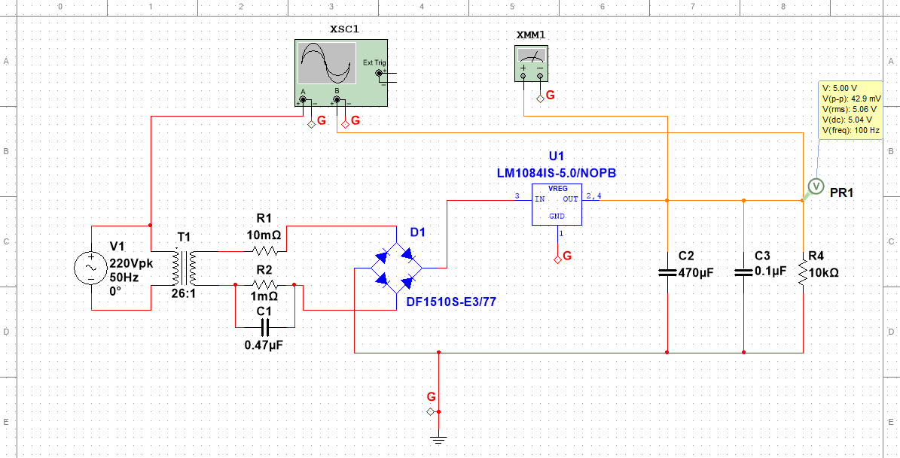
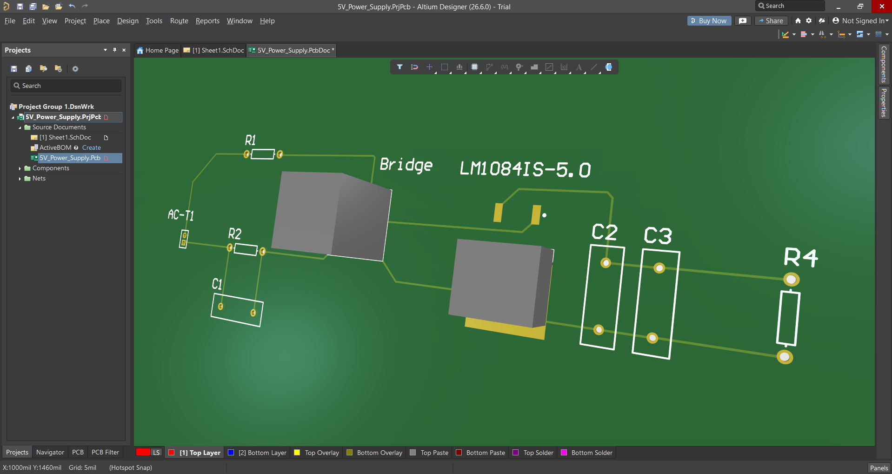
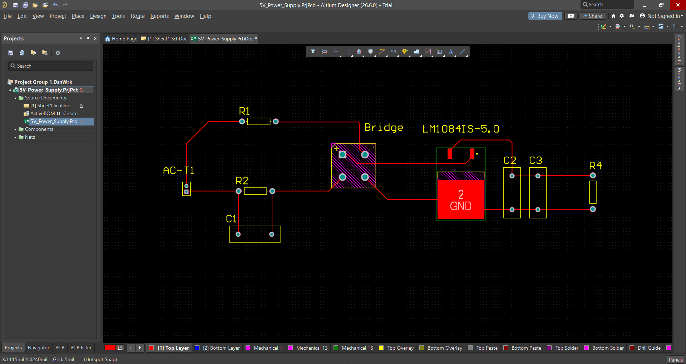
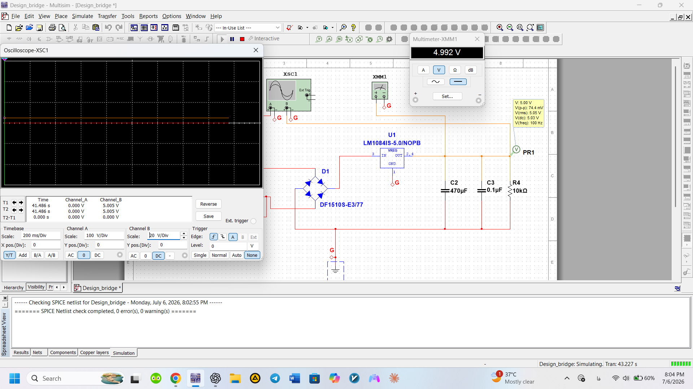

# Bridge Rectifier Power Supply (220V AC to 5V DC)

A regulated AC to DC power supply designed using Altium Designer and verified in NI Multisim.

## Overview

This project demonstrates the design and simulation of a regulated AC to DC power supply.

The circuit converts **220 V AC (50 Hz)** into a stable **5 V DC** output using:

- Full-Wave Bridge Rectifier
- Filter Capacitor
- Linear Voltage Regulator

The circuit schematic and PCB were designed using **Altium Designer**, while the electrical performance was verified using **NI Multisim**.

---
## Features

- AC to DC Conversion

- Full-Wave Bridge Rectifier

- Voltage Regulation

- PCB Design

- Circuit Simulation


## Software

- Altium Designer
- NI Multisim
- Proteus
---

## Input Specifications

| Parameter | Value |
|-----------|------:|
| Input Voltage | 220 V AC |
| Frequency | 50 Hz |

---

## Output Specifications

| Parameter | Value |
|-----------|------:|
| Output Voltage | 5 V DC |

---

## Project Structure

```
├── Images
├── Altium
├── Multisim
├── Documentation
├── Proteus
├── README.md
└── LICENSE
```

---

## Circuit Schematic



---

## PCB Design

### 3D Layer



### 2D Layer



---

## Oscilloscope Results



---

## Documentation

Project report:

📄 [Project Report](Documentation/Report.pdf)

---

## Author

**Pouria Saeedi**

Electrical Engineering Student

## License

This project is released under the MIT License.
